.. currentmodule:: prodyn

.. _DP:

Dynamic Programming
===================

Dynamic Programming (DP) is an optimization technique introduced by Richard 
Bellman, that can be applied to multistage decision problems
requiring a sequence of interrelated decisions. It is based on Bellman's 
principle of optimality which states that a sub-policy of an optimal policy 
for a given problem must itself be an optimal policy of the sub-problem.

In DP the decision problem is usually described as follows. 
The variable x describes the state of the system. x is an element of a set of
possible system states :math:`x \in X = [x^1, x^2, x^3, ...]`. If x not
already a discrete variable, it has to be discretized in order to use DP.
The possible (discrete) decisions (or control signals) that can be applied to 
the system are defined as a set
:math:`u \in U = [u^1, u^2, u^3, ...]`. The function :math:`f_t(x_t,u_t)`
calculates the following state of the system :math:`x_{t+1}` for the current
state :math:`x_{t}` when the decision :math:`u_t` is applied at timestep 
:math:`t`.

.. math::
	
	x_{t+1} = f_t(x_t,u_t)

The function :math:`g_t(x_t,u_t)` calculates the costs 
:math:`c_{t,x_t,u_t}` for going from :math:`x_{t}` to :math:`x_{t+1}` 
when the decision :math:`u_t` is applied at timestep :math:`t`.

.. math::
	
	c_{t,x_t,u_t} = g_t(x_t,u_t)

The DP algorithm finds the control sequence :math:`\pi = [u_1, u_2, ..., u_N]` 
that minimizes the total costs :math:`J` over all timesteps 
:math:`T = [t_1, t_2, ..., t_N]`.

.. math::
    
    J_\pi =\sum_{t=1}^{N}g_t(x_t,u_t^\pi)
    
To find the optimal solution, the DP algorithms proceeds forward or backward
in time solving the subproblem of every timestep under consideration of the
already solved subproblems.

In the following the general idea of both, the forward and the backward 
implementation of DP will be explained based on a simple storage example.

.. _simple-storage-ref:

Simple storage example
----------------------

To explain the DP algorithm a simple storage example is inroduced. A battery
storage with an energy capacity of 1kWh is conected to the grid. The 
electricity price for buying from or selling to the grid for every timestep is
given as a time-series :math:`d_t` (:math:`d_1 = 1€`, :math:`d_2 = 2€`, 
:math:`d_3 = 3€`). The energy content
of the battery, which is the state variable of this system is defined by the
discrete set X = [0kWh, 1kWh], which means the storage can be either full or
empty. The set of possible control signals (decisions) consists of the three
signals: charge with 1 kWh (+1kWh), wait (+-0kWh) and discharge with 1 kWh 
(-1kWh).

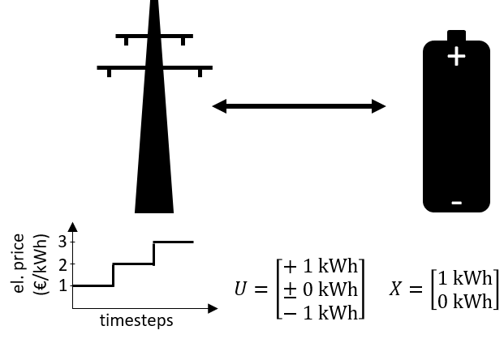
   
   Simple storage example

So, when the battery is charged, the new state is always 1kWh (full), even if
was already full before. When it is discharged, it is allways 0kWh (full) and
if it is neither charged nor discharged, the state stays unchanged.

.. math::
    
    x_{t+1} = 
    \begin{cases} 
    1kWh & \qquad \text{if u = +1kWh}\\
    x_t & \qquad \text{if u = +-0kWh}\\
    0kWh & \qquad \text{if u = -1kWh}
    \end{cases} 

If the storage is charged, we have to pay for the electricity from the grid, so
in this case the costs are defined by the price at the current timestep
:math:`d_t`. If the storage is already full (:math:`x_t` =1kWh), the control 
signal charge (u=+1kWh) is an invalid signal. 
To prevent that this signal will be part of the solution,
we set the (penalty) costs for this case very high (99 €). We do the same, if 
storage is already empty (:math:`x_t` =0kWh) and the signal discharge (u=-1kWh)
is applied. If we discharge a full storage, we sell the electricity to the grid
which results in negative costs :math:`d_t` . If we neither charge nor discharge,
we don't make or spend any money.

.. math::
    
    c_{t,x_t,u_t} = 
    \begin{cases} 
    99 € & \qquad \text{if u=+1kWh and x_t=1kWh} \\
    d_t & \qquad \text{if u=+1kWh and x_t=0kWh} \\
    0 € & \qquad \text{if u=+-0kWh}\\
    -d_t & \qquad \text{if u=-1kWh and x_t=1kWh} \\
    99 €  & \qquad \text{if u=-1kWh and x_t=0kWh}
    \end{cases} 

The following figure shows the possible states x and decisions u of the storage system for
the 3 timesteps. Note, that because we need a defined initial and end state, the
system has 4 states!

   
   Possible states x and decisions u of the storage system
   
   
An implementation of the example can be found in the examples folder.

.. _DP-back-ref:

Backward Dynamic Programming
----------------------------

The Backward Dynamic Programming starts with the last timestep and goes backward
in time to solve the optimization problem step by step. the backward algorithm
is easier to implement (and in prodyn faster) than the forward one.

So based on the possibilities shown in figure XXX, we want to find the path
which leads to the cheapest total costs. Therefore we need to calculate our
total costs :math:`J_t` to get to a certain state in a certain timestep t.
We can also define initial end costs (here :math:`J_3`) for the last timestep,
which is necessary in Backward DP if we want our solution to have a defined end
state (more about this HERE???). In this example, we set the initial end costs
:math:`J_3` (end of last timestep in Backward DP) to 0 € for both possible
states.

   

Now we go one timestep backwards (t=2) and calculate the total costs :math:`J_2`
for every possible state :math:`x_{2}` and every possible decision u. The total
costs :math:`J_2` are defined as the sum of the costs c_{t,x_t,u_t} for going
from :math:`x_{t}` to :math:`x_{t+1}` when the decision :math:`u_t` is applied
at timestep :math:`t` and the total costs :math:`J_3` of the following sate
:math:`x_{t+1}`. Then we select the decision, which leads to least total costs
:math:`J_2` as solution of our sub-problem.

.. math::
    
    J_{t,x_t,u_t} = c_{t,x_t,u_t} + J_{t+1,x_t,u_t}

In our example we start with state :math:`x_{2}=1kWh` . We try to charge
(u=+1kWh) the full storage, the costs are very high because of the penalty costs
(c=99€). The following state is here defined as `x_{3}=1kWh` . If we wait, we
have no costs (c=0€) and the foloowing state stays the same `x_{3}=1kWh` .
If we discharge, we sell the electricity to the grid for the current price
:math:`d_3 = 3€`, which leads to costs of c=-3€. Since :math:`J_3=0€` for
every following state, here discharging leads to the minimal total costs.

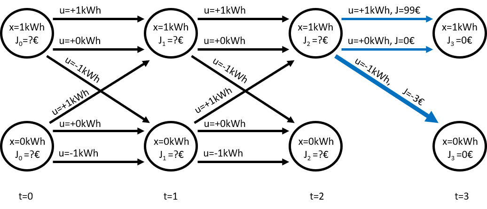

If we do the same for state :math:`x_{2}=0kWh`, we see that the costs for
waiting (c=0€) is cheaper than for charging (c=3€) and discharging (c=99€).
Since :math:`J_3=0€` the go-to costs c already represent the total costs J.

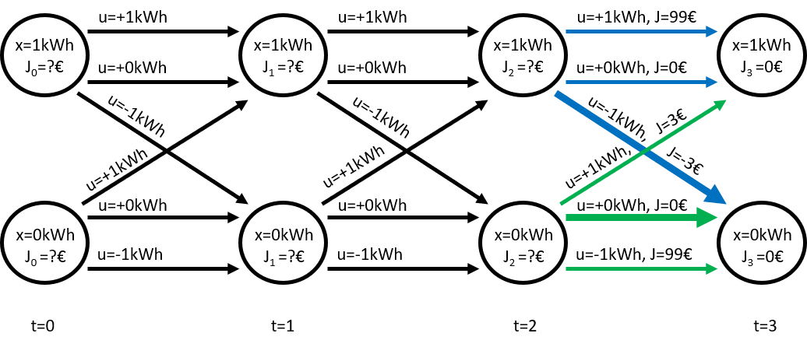

Now for every possible state :math:`x_{2}` we select the decision (path) which
leads to the lowest total costs :math:`J_2`. We discard all other options, whcih
is basically the "trick" in DP. If we are in timestep 2, we now the best
solution to go from here for every possible state :math:`x_{2}`. So all other
states are not relevant for the solution.
In our example, we can see, that a full storage at the end of timetsep 3 will
not be part of the solution. If we wanted to find a solution, where the storage
is full at the end, we should have defined proper initial total costs
:math:`J_2` .

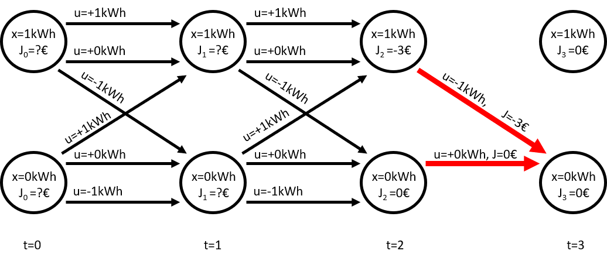

Now we go one more timestep backwards (t=1) and calculate the total costs 
:math:`J_1` for every possible state :math:`x_{1}` and every possible 
decision u. Now we have to consider the total following costs :math:`J_2` 
dependent on the following state :math:`x_{2}` . Here, the decisions leading
to the cheapest total costs are waiting for :math:`x_{1}=1kWh` and charging
for :math:`x_{1}=0kWh` .

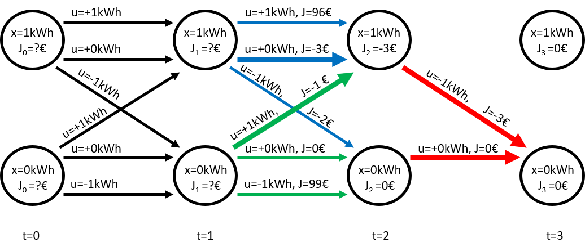
   
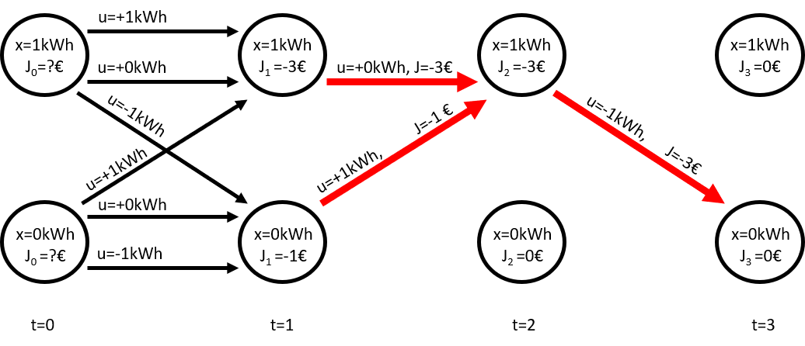

Once again, we go one more timestep backwards (t=0) and calculate the total 
costs 
:math:`J_0` for every possible initial state :math:`x_{0}` and every possible 
decision u. Now we have to consider the total following costs :math:`J_1` 
dependent on the following state :math:`x_{1}` . Here, the decisions leading
to the cheapest total costs are waiting for :math:`x_{0}=1kWh` and charging
for :math:`x_{0}=0kWh` . 

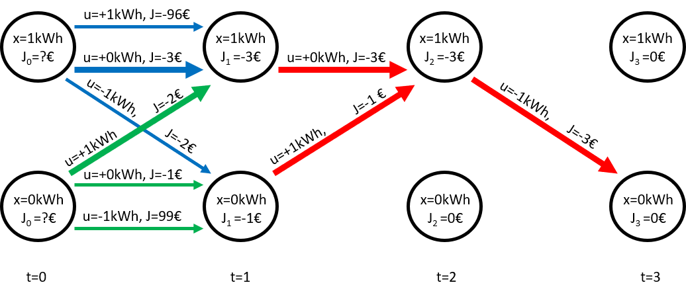
   
.. figure:: img/DP_bw_08.png
   :width: 90%
   :align: center

As we can see, the Backwards Dynamic Programming algorithm (in prodyn)
gives us the solution for every possible initial state :math:`x_{0}` . If we
want the solution to have a specific end state, we have to define initial
costs :math:`J_end` . How to do this is prodyn see :ref:`init-costs-ref`

.. _DP-forw-ref:

Forward Dynamic Programming
----------------------------

The Forward Dynamic Programming starts with the first timestep and goes forward
in time to solve the optimization problem step by step. The forward algorithm
is more difficult to implement (and in prodyn slower) than the backward one.
The advantage of the forward algorithm is that it allows one to use the 
results and states of all previous timesteps to calculate the next state and
the costs.

Again we want to find the path which leads to the cheapest total costs,
based on the possibilities shown in the following figure.

Therefore we need to calculate our
total costs :math:`J_t` to get to a certain state in a certain timestep t.
We can also define initial costs (here :math:`J_0`) for the first timestep,
which is necessary in forward DP if we want our solution to have a defined 
starting state (see :ref:`init-costs-ref`). In this example, we set 
the initial costs :math:`J_0` to 0 € for both possible states.

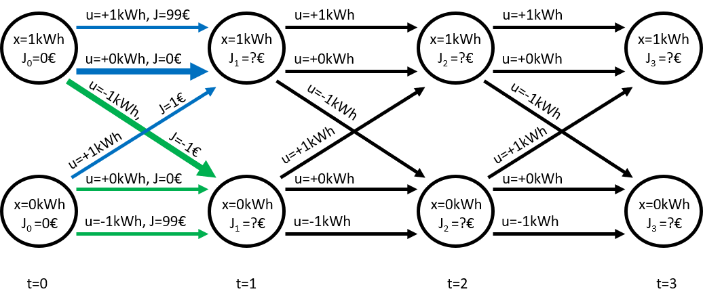

Now we calculate the total costs :math:`J_1`
for every possible initial state :math:`x_{0}` and every possible decision u. 
The total
costs :math:`J_1` are defined as the sum of the costs c_{t,x_t,u_t} for going
from :math:`x_{t}` to :math:`x_{t+1}` when the decision :math:`u_t` is applied
at timestep :math:`t` and the total costs :math:`J_0` of the previous sate
:math:`x_{t}`. Then for each possible following state :math:`x_{t+1}` , 
we select the decision, which leads to least total costs
:math:`J_1` as solution of our sub-problem.

.. math::
    
    J_{t,x_t,u_t} = c_{t,x_t,u_t} + J_{t+1,x_t,u_t}

In our example we start with state :math:`x_{0}=1kWh` . If we try to charge
(u=+1kWh) the full storage, the costs are very high because of the penalty costs
(c=99€). The following state is here defined as :math:`x_{1}=1kWh` . 
If we wait, we
have no costs (c=0€) and the foloowing state stays the same :math:`x_{1}=1kWh` .
If we discharge, we sell the electricity to the grid for the current price
:math:`d_1 = 1€`, which leads to costs of c=-1€. 
If we do the same for state :math:`x_{0}=0kWh`, we can caculate the costs for
waiting (c=0€), charging (c=1€) and discharging (c=99€).

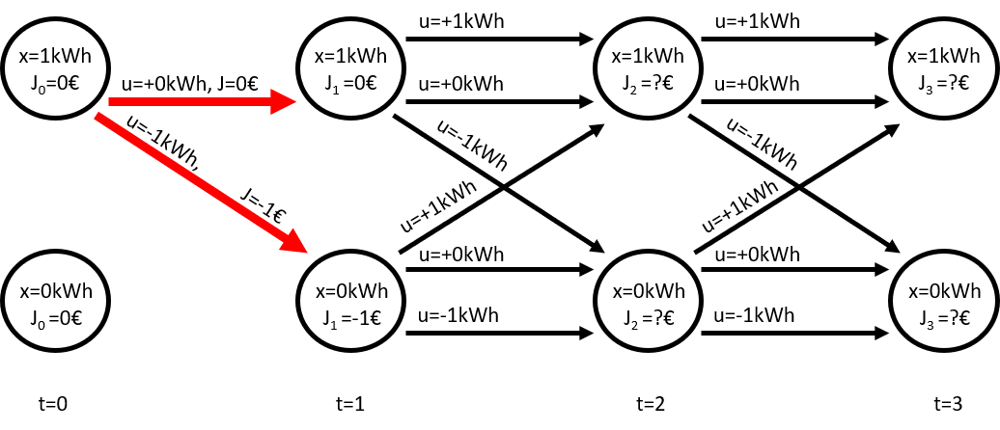

To choose the cheapest path, in forward DP we want to find the decision, which
leads to the minimal total costs J for getting to each possible following state.
So at first we have a look at the following state :math:`x_{1}=1kWh` .
From the 3 options to get to this state (blue), we choose the one with the 
cheapest total costs J, which is from state :math:`x_{0}=1kWh` by waiting 
(u=+-0kWh).

Now we look at the following state :math:`x_{1}=0kWh` . To get there we have
again 3 options (green). We choose the option discharging (u=-1kWh)
from previous state `x_{0}=1kWh`
, which is the option with the least total costs J.

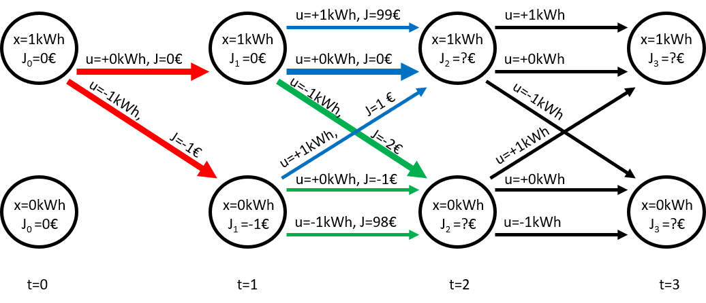

Now we so the same for the following timesteps, as shown in the following 
figures.

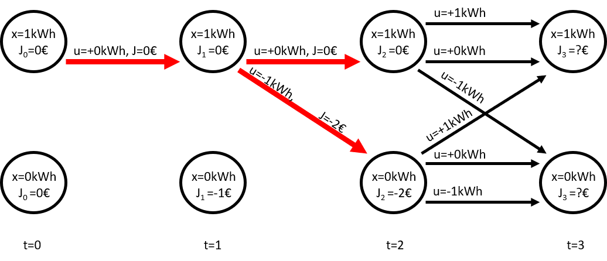
   
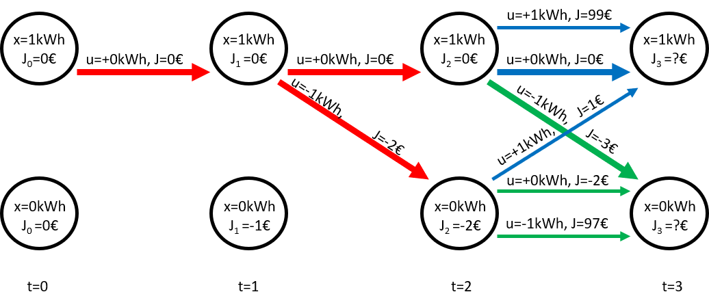
   
.. figure:: img/DP_fw_07.png
   :width: 90%
   :align: center

After finishing with the last timestep, we have an optomal solution for 
every possible end state :math:`x_{3}`.

As we cann see, starting from an empty storage :math:`x_{0}=0kWh` was already 
excluded as part of optimal solution after the first step. 
If we want to have a specific initial state in forward DP, we have to define
initial costs :math:`J_end` . How to do this is prodyn see 
:ref:`init-costs-ref`

