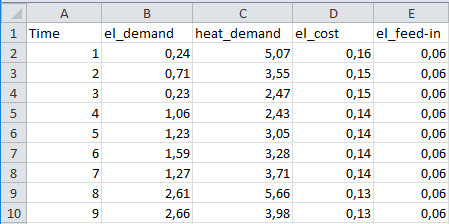
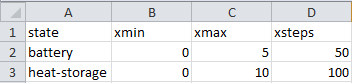
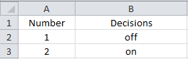

.. currentmodule:: prodyn

.. _example_data:

Example_data
========================
Example_data is a file in excel-form. It stores an information about a system, which operation should be controlled in an optimal way. All data is split between four sheets: **Time-Series**, **Constants**, **DP-States** and **DP-Decisions**. Each of this sheet is described below. 

Time-Series
^^^^^^^^
A series of values for parameters, which described the system, is shown here. Values are obtained at successive times and with equal intervals between them. Small part of **Time-Series** from ``chp_data`` is illustrated in the Figure 2.   

   
   Figure 2: **Time-Series** from ``chp`` example
        
Constants
^^^^^^^^ 
This sheet keeps all values for parameters, which doesn't change during any operation of the system. 

DP-States
^^^^^^^^
The part of the system, which operation should be optimized, is characterized by a number of states. Each state has min, max allowable values and number of steps between them. All these data is stored in **DP-States** sheet. **DP-States** for ``chp`` example is shown in the Figure 3.   

   
   Figure 3: **DP-States** from ``chp`` example
   
As seen from the Figure 3 the system has two states. State of the **battery** can take values from **0** to **5** with a step equaled to **0,1**. Similarly **heat-storage** is changing between **0** and **10** with a step **0,1**. 

DP-Decisions
^^^^^^^^
An operation of the system for every timestep can be influenced by one of the specific decisions, which are written in **DP-Decisions** sheet. In other words, all possibilities for system control are written here. Figure 4 illustrates decisions for the same ``chp`` example.  

   
   Figure 4: **DP-Decisions** from ``chp`` example
   
As seen above ``chp`` example has only two decisions: **off** and **on** operation of the combined heat and power plant.

