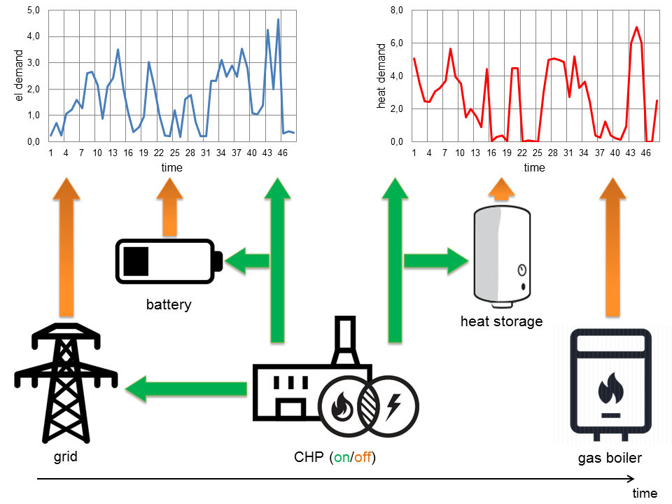
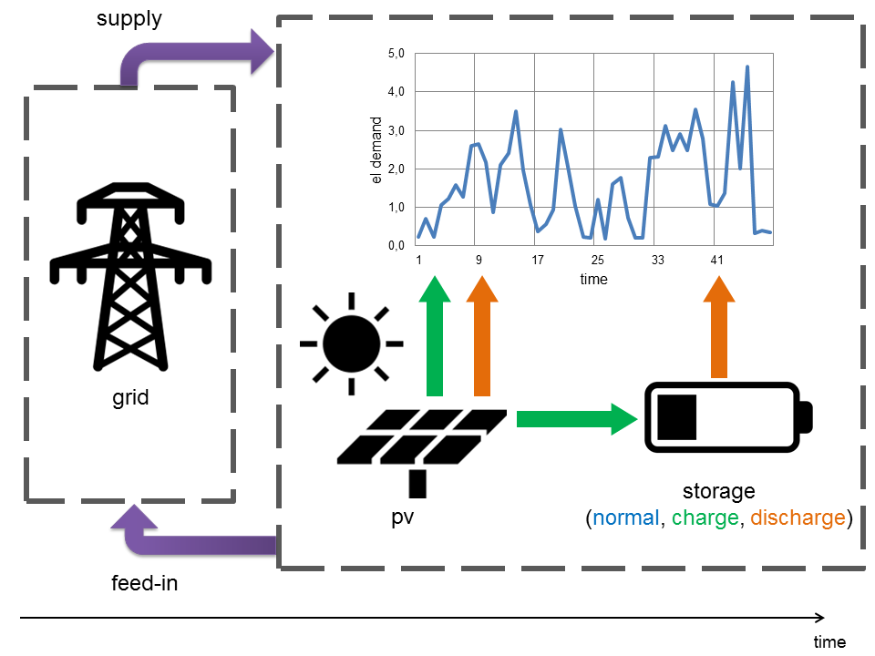
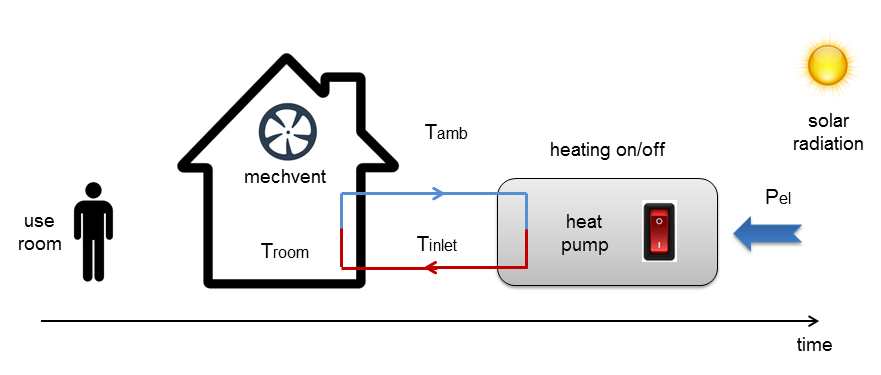
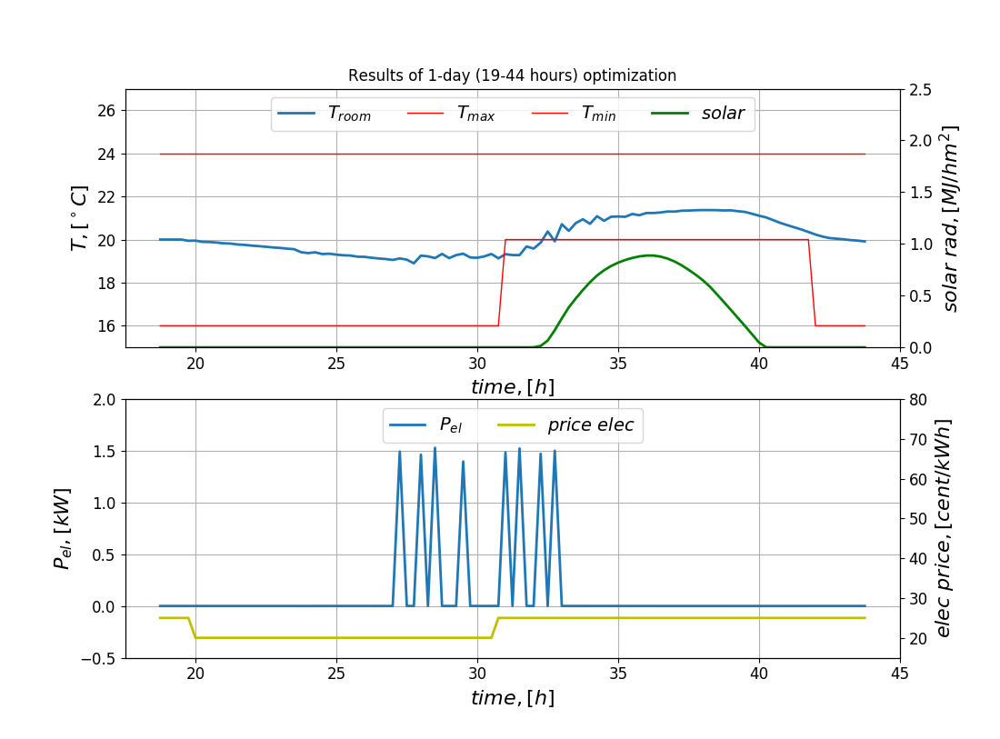
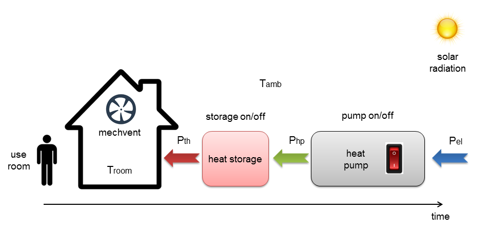

.. currentmodule:: pyrenn

.. _examples:

Examples
============

The examples given in this chapter show how to implement dynamic programming 
algorithm. The first example is presented very 
detailed. For other systems only brief description is given. 
An implementaion of each example can be found in the example folder.

Simple storage example
----------------------

Description
^^^^^^^^^^^^^^^^

In this example a battery
storage with an energy capacity of 1kWh is conected to the grid. The 
electricity price for buying from or selling to the grid for every timestep is
given as a time-series :math:`d_t` (:math:`d_1 = 1€`, :math:`d_2 = 2€`, 
:math:`d_3 = 3€`). The energy content
of the battery, which is the state variable of this system is defined by the
discrete set X = [0kWh, 1kWh], which means the storage can be either full or
empty. The set of possible control signals (decisions) consists of the three
signals: charge with 1 kWh (+1kWh), wait (+-0kWh) and discharge with 1 kWh 
(-1kWh).

.. figure:: img/storage_example.png
   :width: 90%
   :align: center
   
   Simple storage example

So, when the battery is charged, the new state is always 1kWh (full), even if
was already full before. When it is discharged, it is allways 0kWh (full) and
if it is neither charged nor discharged, the state stays unchanged.

.. math::
    
    x_{t+1} = 
    \begin{cases} 
    1kWh & \qquad \text{if u = +1kWh}\\
    x_t & \qquad \text{if u = +-0kWh}\\
    0kWh & \qquad \text{if u = -1kWh}
    \end{cases} 

If the storage is charged, we have to pay for the electricity from the grid, so
in this case the costs are defined by the price at the current timestep
:math:`d_t`. If the storage is already full (:math:`x_t` =1kWh), the control 
signal charge (u=+1kWh) is an invalid signal. 
To prevent that this signal will be part of the solution,
we set the (penalty) costs for this case very high (99 €). We do the same, if 
storage is already empty (:math:`x_t` =0kWh) and the signal discharge (u=-1kWh)
is applied. If we discharge a full storage, we sell the electricity to the grid
which results in negative costs :math:`d_t` . If we neither charge nor discharge,
we don't make or spend any money.

.. math::
    
    c_{t,x_t,u_t} = 
    \begin{cases} 
    99 € & \qquad \text{if u=+1kWh and x_t=1kWh} \\
    d_t & \qquad \text{if u=+1kWh and x_t=0kWh} \\
    0 € & \qquad \text{if u=+-0kWh}\\
    -d_t & \qquad \text{if u=-1kWh and x_t=1kWh} \\
    99 €  & \qquad \text{if u=-1kWh and x_t=0kWh}
    \end{cases} 

The following figure shows the possible states x and decisions u of the storage system for
the 3 timesteps. Note, that because we need a defined initial and end state, the
system has 4 states!

.. figure:: img/DP_general.png
   :width: 90%
   :align: center
   
   Possible states x and decisions u of the storage system

Implementation
^^^^^^^^^^^^^^^^

Imports
^^^^^^

Import pandas and numpy for data handling and operation, prodyn for using DP
and matplotllib for plotting.

::

    import pandas as pd
    import numpy as np
    import prodyn as prd
    import matplotlib.pyplot as plt

States
^^^^^^

At first, we describe the state variable "battery" of our system by defining
its minimum and maximum value and the number of dicretization steps
therefore we create a pandas DataFrame where the index represents the states
(here only "battery") and the columns ['xmin','xmax','xsteps']
states = pd.DataFrame(index=['battery'], columns=['xmin','xmax','xsteps'])

we define a battery with 1 kWh capacity and define our steps to be 2 
(0kWh, 1kWh)

::

    states.loc['battery','xmin'] = 0
    states.loc['battery','xmax'] = 1
    states.loc['battery','xsteps'] = 2

Controls (decisions)
^^^^^^^^^^^^^^^^^^^^

Now we define the possible control signals (decisions) of our system. Therefore 
we simply create a list containing all possible control signals. This can be 
numbers, or strings or any other type of variable, as long as the system model 
is defined such that it can handle the defined control signals. 
In our case we choose integers to represent our control signal. 1 for charging
the battery, 0 for doing nothing, -1 for dischraging it.

::

    controls = [-1,0,1] #The set of control signals/decisions (often called "U")

timesteps
^^^^^^^^^^

We define the timesteps for our optimization. In this case we want to optimize
for 3 hours, so we define a numpy array [0,1,2,3]

::

    timesteps=np.arange(1,4)

Constant Parameters
^^^^^^^^^^^^^^^^^^

We can define two variables that contain constant parameters we can access
within our system function. Both variables can be defined as any type 
(dict, pandas DataFrame, list, array, constant,....)
For a better readability I usually define one variable containing all the 
time independent constants and one variable containing a timeseries
For this simple example, we define a constant variable as a dict, containing 
only the maximum capacity of the battery and a pandas DataFrame containing 
the electricity price curve (with timestpes as index)

::

    constants = {'max_cap': 1}
    timeseries = pd.DataFrame(index=timesteps, columns=['el. price'])

As an incentive to use the storage we define a price curve with low costs 
in the beginning and high costs at the end of the day

::

    timeseries['el. price'] = np.array([1,2,3])
                            
System model
^^^^^^^^^^^^

Now we define the function describing our system. The function calculates for 
every possible state x and a given control signal u the following state x_j
and the costs for going from x to x_j.
Allowing prodyn to use a function, it has to be defined following some rules
for the inputs and outputs.
The function has to be defined with 6 inputs (u,x,t,cst,Srs,Data), where:

* u is the current control signal (decision) within possible decisions U 
  in our case u is one element of our defined controls, either -1, 1 or 0
* x is a numpy array with dicretized steps of the state 
  in our case x = [0, 1, 2, 3, 4, 5]
* t is the current timestep
* cst is one of our constant variables we defined, in our case constants
* Srs is the other constant variables we defined, in our case timeseries
* Data is a Dataframe created by prodyn containing previous results of the
  optimization. It allows us to access results from already solved
  timesteps. For this example, Data will not be used. How to use it
  is explained in another example.

The function has to return 3 outputs (cost, x_j, data), where:

* cost is a numpy array of the same size as x containing the cost for going
  from x to x_j when using control signal u
* x_j is the following state of x (numpy array of the same size as x)
* data contains additional variables that will be saved in the result DataFrame
  "Data", which also can be used in the following timesteps. 
  data has to be defined as a pandas DataFrame with index x and 
  a column for each variable that should be saved. It is not necessary
  to use data, but it has to be defined as a (empty) pandas DataFrame 
  with index=x

Of course, the names of the inputs and outputs can be changed, but the order 
and typ of the variables have be to as described

::

    def storage_model(u,x,t,cst,Srs,Data):

        #for our simple model we initialize the arrays cost and x_j with zeros
        #the arrays have to be the same size as x
        l = len(x) #number discretization steps of x    
        cost = np.zeros(l)
        x_j = np.zeros(l)
        
        #we inizialize an additional array penelty_cost, which we use in our model
        penalty_cost = np.zeros(l)
        
        #We have to calculate the following state x_j and the cost using the control
        #signal u for every possible state beginning state x_i (every element of x)
        #In this example we use a loop to do this: 
        
        for i,x_i in enumerate(x):
            
            #prodyn always minimizes the total costs over all timesteps
            #here we define the costs to be positive when we charge the battery
            #because we have to buy electricity and negative when we discharge it,
            #because then we sell electricity. The costs are zero, if we do nothing.
            #In this simple example we can charge or discharge with 1 kW per 
            # timestep (1 hour), so we increase or decrease the storage content by 
            # 1kWh. So the costs are defined by the electricity price in the current
            #timestep. By muliplying the price with the control signal u, which is
            #-1 for discharging, 0 for doing nothing and 1 for discharging, the cost
            #becomes negative, zero or positive, as we defined it.
            cost[i] = (u * Srs.loc[t]['el. price'])
            #as just described, the battery energy content, which is our state 
            #variable increase by 1 kWh when charging the battery (u=1), decreases 
            #by 1 kWh when discharging it (u=-1) and stays the same when doing 
            #nothing (u=0)
            x_j[i] = x_i + u
            
            #With our definition above, it would be psooible that an already fully
            #charged battery with 5kWh energy content could be charged up to 6kWh
            #If this happens, change the energy content back to 5 kWh ('max_cap')
            #and we set the penalty costs to a high value (999)
            if x_j[i] > cst['max_cap']:
                x_j[i] = cst['max_cap']
                penalty_cost[i] = 999
            #we do the same, if the energy content goes below 0 kWh.
            elif x_j[i] < 0:
                x_j[i] = 0
                penalty_cost[i] = 999
            
            #Now we add the penalty costs to the cost. High costs prevent that this
            #decision (control signal) will be chosen by the algorithm to be part of
            #the solution with minimal costs at the end
            cost[i] = cost[i] + penalty_cost[i]
        
        #We have to create a pandas DataFrame with index=x for the output (even
        #if we don't use it)
        data = pd.DataFrame(index = x)
        #We create the row 'cost', where we save the costs for every x when applying
        #control signal u at the current timestep t. Tzhe costs will be saved in the
        # results and we cann acess them after the problem is solved.
        data['cost'] = cost
        
        return cost,x_j,data

Solving the problem and accessing the solution using prodyn
^^^^^^^^^^^^^^^^^^^^^^^^^^^^^^^^^^^^^^^^^^^^^^^^^^^^^^^^^^^^

Prodyn can be used to find the control sequence that leads to the minimum
total costs over the optimization horizon (timesteps) using the dynamic
programming algorithm.
prodyn has two different implementations of the DP algorithm.
DP_forward solves the problem "forward in time", which means the algorithm
starts at the first timestep, while the DP_backward starts at the last timestep
and solves the problem "backward in time". The forward algorithm has the 
advantage, that states and calculated parameters from previous timesteps
can be used in the model, which might be necessary to model the problem.
The backward algorithm only can access "future" states and parameters, but
because it is usually faster and therefore should be chosen if past information
is not necessary to model the problem. Both algorithms are described more
detailed in the chapter "how prodyn works".

DP_forward
""""""""""""

::

    result_fw = prd.DP_forward(states,controls,timesteps,constants,timeseries,
                               storage_model,verbose=True,t_verbose=1)

                               
Here we want to get the results where the storage is empty at the end (Xidx_end=0)

::
    
    result0_fw = result_fw.xs(0,level='Xidx_end')

DP_backward
""""""""""""

::

    result_bw = prd.DP_backward(states,controls,timesteps,constants,timeseries,
                                storage_model,verbose=True,t_verbose=1)

Here we want to get the results where the storage is empty at the beginning 
(Xidx_start=0)

::

    result0_bw = result_bw.xs(0,level='Xidx_start')
    
    
And compare it to the results where the storage is full at the beginning 
(Xidx_start=1)

::

    result5_bw = result_bw.xs(1,level='Xidx_start')

Now we can plot the results    

:: 

    plt.plot(result0_fw['battery'],'b')
    plt.plot(result5_bw['battery'],'g-.')
    plt.plot(result0_bw['battery'],'r:')
    plt.show()

  
CHP
------
Grid, gas-boiler, chp power plant, battery and heat storage are components of the system, which should cover given heat and electical demand. Energy contents of the battery and heat storage are 2 states of the system. When **chp** is **on**, it covers the demand. Surplus of electricity is stored in the battery and sold to the grid. Surplus of the heat is stored in the heat storage. When **chp** is **off**, at first both demands are covered by storages, then by the grid and gas boiler. The goal of optimization is to find the path, where both storages will be empty at the final timestep. Figure 14 shows simplified scheme of the **chp** system.     

   
   Figure 14: Illustration of the **chp** example
   
PV Storage
-----------
Photovoltaic system with storage form the system for covering given electrical demand. Energy content of the storage is the only state of the system. List **U** contains three possible decisions. With **normal** system operates without participation of the storage. Possible surplus of the produced by pv power can be saved in the storage with **charge** decision. With **discharge** system tries to cover the residual demand by stored energy. After each possible system's decision **grid load** is checked. This residual power is covered by or fed into the grid. The main goal is to find the result, where the storage is empty at the end. Illustration of the current example is presented in the Figure 15.       

   
   Figure 15: Illustration of the **pv_storage** example
   
**Pv_storage_model**, which describes the transition from **i** to **j** according to each possible decision **u**, is written in two ways. In first case the transition is applied for the whole **array X**, which characterizes the system. In the second case - for each possible condition of **X**. Calculation for each condition and jump from one to another are realized inside the **loop**.     

Building
--------------

Description
^^^^^^^^^^^^^^

A system in **building** example contains a model of the real building (pre-trained Neural Network) and a heat pump. The goal of the optimization is to keep room temperature **Troom** inside the range of allowed values **[Tmin; Tmax]** in a cost-efficient way.
Simulation covers one day (19-44 hours) with 15 min time resolution. The picture in the Figure 11 visualizes current system.

   
   Figure 11: Illustration of the **building** example
   
Dynamic Programming algorithm for optimal control of the **building** is realized with using four following files: 
	
	* **building_data.xlsx** - stores information about the system.
   	* **building_model.py** - reads system's data and describes transition from one timestep to another.
   	* **prodyn.py** - realizes dynamic programming algorithm.
   	* **run_building_forward.py** - runs the simulation and finds the optimal system's control.
	
**Run_building_forward.py** and **building_model.py** are described in detail below. 
	

   
run_building_forward.py
^^^^^^^^^^^^^^^^^^^^^^^^^^

There is a script of the ``run_building_forward.py`` (one from four dynamic programming files) is explained step by step for better understanding. 

::

    import numpy as np
    import matplotlib.pyplot as plt
    import pyrenn as prn
    
Three packages are included: 

* `numpy`_ is the fundamental package for scientific computing with Python;
* `matplotlib.pyplot`_ is a plotting library which allows present results in a diagram form quite easily;
* `pyrenn`_ is a recurrent neural network toolbox for Python. 

::

	import building_model as model
	import prodyn as prd
	
Then **building_model** and **prodyn** (two other files of dynamic programming) are imported. They assigned as **model** and **prd** respectively. 

::

	file = 'building_data.xlsx'
	
Gives the path to the excel-file **building_data** containing data about the current system. This is the last file of dynamic programming.  

::

	cst,srs,U,states = model.read_data(file)
	srs['massflow'] = 0
	srs['P_th'] = 0
	srs['T_room'] = 20
	
Defines constants **cst**, timeseries **srs**, list of possible decisions **U** and parameters **states**, which characterize each possible **building's** state, by reading the **building_data** file. Process of reading is realized due to **read_data** function hidden in the **building_model** (model) file. To timeseries **srs** written from **building_data** some extra data is added. 

::

	timesteps=np.arange(cst['t_start'],cst['t_end'])
	
Sets a timeframe on which optimization will be realized. 

::

	net = prn.loadNN('NN_building.csv') 
	cst['net'] = net
	
Defines a model **net** of the real building (pre-trained Neural Network) and saves it to the constants **cst**. 

::

	xsteps=np.prod(states['xsteps'].values)
	J0 = np.zeros(xsteps)
	idx = prd.find_index(np.array([20]),states)
	J0[idx] = -9999.9
	
Creates an array **J0** of initial terminal costs. **J0** will be changed from transition to transition according to list of possible decisions **U** and will keep all costs. Due to stored infromation in **J0** optimal control of the **building** can be found. 

::

	idx = prd.find_index(np.array([20]),states)
	J0[idx] = -9999.9
	
Shifts the initial postition to index with temperature equaled to 20 degrees. 

::

	system=model.building
	
Defines function **building** from **building_model** for characterization the transition from one timestep to another.

::

	result = prd.DP_forward(states,U,timesteps,cst,srs,system,J0=J0,verbose=True,t_verbose=5)
	i_mincost = result.loc[cst['t_end']-1]['J'].idxmin()
	opt_result = result.xs(i_mincost,level='Xidx_end')
	
Implements dynamic programming algorithm for the chosen timeframe and saves all data to the **result**. Then finds index for cost-minimal path, extracts it from **result** and saves to **opt_result**. 

::

	best_massflow=opt_result['massflow'].values[:-1]
	Troom=opt_result['T_room'].values[:-1]
	Pel=opt_result['P_el'].values[:-1]

Chooses parameters, which characterize cost-efficient **building** control system, and extracts them from **opt_result**. **Best_massflow** is a schedule, which shows at which timestep heat pump is switched on and at which switched off. **Pel** defines consumed electrical power, **Troom** - room temperature inside the house, which shouldn't be out of the comfort zone **[Tmin; Tmax]**.   

::

	Troom=np.concatenate((srs.loc[timesteps[0]-4:timesteps[0]-1]['T_room'],Troom))
	Pel=np.concatenate((srs.loc[timesteps[0]-4:timesteps[0]-1]['P_th'],Pel))
	
Sums values for timesteps, which were not involved in the optimization, with those, which were extracted from **opt_result**. The remaining part of the code is responsible for plotting chosen and additional parameters. They are presented in the Figure 12. 

   
   Figure 12: Cost-minimal control of the **building** for keeping **Troom** inside **[Tmin; Tmax]**.  

building_model.py
^^^^^^^^^^^^^^^^^^^

The script of the ``building_model.py`` is explained step by step for better understanding. 

::

	import pandas as pd
	import numpy as np
	import pyrenn as prn
	import pdb
	
Three packages are included: 

* `pandas`_ is a source helping to work with data structure and data analysis; 
* `numpy`_ is the fundamental package for scientific computing with Python;
* `pyrenn`_ is a recurrent neural network toolbox for Python;
* `pdb`_ is a specific module, which allows to debug Python codes.

::

	def read_data(file):
		xls = pd.ExcelFile(file)
	    	states = xls.parse('DP-States',index_col=[0])
	    	cst = xls.parse('Constants',index_col=[0])['Value']
	    	srs = xls.parse('Time-Series',index_col=[0])
	    	U = xls.parse('DP-Decisions',index_col=[0])['Decisions'].values
	    	return cst,srs,U,states
	    
**Read_data** reads data about the **building** system from the excel-file and assigns it to different parameters. 

::

	def building(u,x,t,cst,Srs,Data):
		l = len(x)
    		delay=4
    		net = cst['net']
		
Opens function **building** responsible for the system transition. Also identifies the length **l** of the array with possible system states **x**, gives a name to the pre-trained Neural Network (NN) **net** and chooses number of timesteps **delay** for the initial input **P0** and output **Y0** needed for the NN's usage.

::

		hour = Srs.loc[t]['hour']
		solar = Srs.loc[t]['solar']
		T_amb = Srs.loc[t]['T_amb']
		user  = Srs.loc[t]['use_room']
		T_inlet = Srs.loc[t]['T_inlet']
	
Creates 5 inputs for the input array **P** required for the NN's usage. 

::

		if u=='heating on':
			massflow = cst['massflow']
		elif u=='heating off':
			massflow = 0
		
Defines the 6th and the last input of **P** in dependance of the current decision **u**. 

::

		P = np.array([[hour],[solar],[T_amb],[user],[massflow],[T_inlet]],dtype = np.float)
	
Builds the input array **P** from six inputs for the current timestep **t**. 

::

		hour0 = Srs.loc[t-delay:t-1]['hour'].values.copy()
		solar0 = Srs.loc[t-delay:t-1]['solar'].values.copy()
		T_amb0 = Srs.loc[t-delay:t-1]['T_amb'].values.copy()
		user0  = Srs.loc[t-delay:t-1]['use_room'].values.copy()
		T_inlet0 = Srs.loc[t-delay:t-1]['T_inlet'].values.copy()
	
Creates 5 inputs for the initial input array **P0**, which is also needed for the NN's usage. The length of each input is equaled to the chosen **delay** at the beginning of the function. 

::

		x_j = np.zeros(l)
		P_th = np.zeros(l)
		costx = np.zeros(l)
	
Defines array **x_j** for the **building** states after the transition, array **P_th** for thermal power given to the **building** from heat pump and array **costx**, which will contain penalty costs for transition from each **building** state in **x** to **x_j** according to current decision **u**.

::

		for i,xi in enumerate(x):
        		#prepare 6th input for P0 and 2 outputs for Y0
        		if t-delay<cst['t_start']:
            			
				#take all values for P0 and Y0 from timeseries            
            			if Data is None or t==cst['t_start']:
                			T_room0 = Srs.loc[t-delay:t-1]['T_room'].values.copy()
                			P_th0 = Srs.loc[t-delay:t-1]['P_th'].values.copy()
                			massflow0 = Srs.loc[t-delay:t-1]['massflow'].values.copy()
                        	
				#take part of values from timeseries and part from big Data            
            			else:
                			tx = t-cst['t_start']
                			T_room0 = np.concatenate([Srs.loc[t-delay:t-tx-1]['T_room'].values.copy(),Data.loc[t-tx-1:t1].xs(i,level='Xidx_end')['T_room'].values.copy()])
                			P_th0 = np.concatenate([Srs.loc[t-delay:t-tx-1]['P_th'].values.copy(),Data.loc[t-tx-1:t-1].xs(i,level='Xidx_end')['P_th'].values.copy()])
                			massflow0 = np.concatenate([Srs.loc[t-delay:t-tx-1]['massflow'].values.copy(),Data.loc[t-tx-1:t-1].xs(i,level='Xidx_end')['massflow'].values.copy()])
                	
			#take all values for P0 and Y0 from big Data
        		else:
				T_room0 =Data.loc[t-delay:t-1].xs(i,level='Xidx_end')['T_room'].values.copy()
            			P_th0 = Data.loc[t-delay:t-1].xs(i,level='Xidx_end')['P_th'].values.copy()
            			massflow0 = Data.loc[t-delay:t-1].xs(i,level='Xidx_end')['massflow'].values.copy() 
				
Loop for every possible state of the **building** from **x** opens. All other strings are responsible for prepairing the 6th input **massflow0** for the input array **P0** and two outputs **T_room0**, **P_th0** for the initial output array **Y0**. In dependance of relation between current timestep **t** and **t_start** (initial timestep, from which optimal **builidng** control should be found) these three parameters are created with values from the timeseries **srs** and **Data**, which keeps all information about the previous transitions. There are three cases for the **massflow0**, **T_room0** and **P_th0** creation. Supporting commentaries in this part split these cases. 

::

		T_room0[-1] = xi             
        	P0 = np.array([hour0,solar0,T_amb0,user0,massflow0,T_inlet0],dtype = np.float)
        	Y0 = np.array([T_room0,P_th0],dtype = np.float)
		
Corrects last value of **T_room0** and builds initial input **P0** and initial output **Y0** arrays. 

::

		if np.any(P0!=P0) or np.any(Y0!=Y0):
            		#if P0 or Y0 not valid use valid values and apply penalty costs
            		costx[i] = 1000*10
            		x_j[i] = xi
            		P_th[i] = 0
        	else:
            		x_j[i],P_th[i] = prn.NNOut(P,net,P0=P0,Y0=Y0)
        
        	if x_j[i] != x_j[i] or P_th[i] != P_th[i]:
            		pdb.set_trace()
			
Runs NN for one timestep. Checks if **P0** and **Y0** are valid. Two outputs of the NN usage are array **x_j**, which keeps all possible states of the **building** after transition, and array **P_th**, which stores data about delivered thermal power from the pump to the building. In the case of mistake a Python debugger will be open. Here the loop for every possible state of the **building** from **x** closes.

::

	Tmax = Srs.loc[t]['Tmax']
    	Tmin = Srs.loc[t]['Tmin']    
   
   	costx = (x_j>Tmax)*(x_j-Tmax)**2*1000 + (x_j<Tmin)*(Tmin-x_j)**2*1000+costx
	
Selects borders for the allowed **T_room** and calculates penalty costs **costx** if any state of **x_j** is out of chosen borders. 

::

	x_j=np.clip(x_j,x[0],x[-1])

Corrects **x_j**. Values smaller than **x[0]** become **x[0]**, and values larger than **x[-1]** become **x[-1]**. 

::

	P_el = P_th*T_inlet/(T_inlet-T_amb)
    	cost = P_el * Srs.loc[t]['price_elec']*0.25 + costx
	
Calculates **cost** of the transition by summing electricity and penalty costs. 

::

	data = pd.DataFrame(index = np.arange(l))
    	data['P_th'] = P_th
    	data['P_el'] = P_el
    	data['T_room'] = x_j
    	data['massflow'] = massflow
    	data['cost'] = cost
    	data['costx'] = costx
           
    	return cost, x_j, data
	
Defines parameters, which will be put in **data** used in **prodyn** file. Returns of the **building** function are costs of the transition **cost**, new array with **building** states **x_j** and **data**. 

Building with Storage
-----------------------

The presence of the **heat storage** makes this system different to the **building**. Due to this **building_with_storage** has 4 decisions and 2 states (the room temperature **Troom** and energy content of the storage **E**). The goal and period of simulation are identical to the **building** example. In the Figure 13 schematic picture the **building_with_storage** system is given.

By reason of long-time simulation the results are already given in the folder related to this example. 

   
   Figure 13: Illustration of the **building_with_storage** example
   
.. note::

	
	**Building** and **building_with_storage** examples can be simulated only in **forward** direction.  
 

.. _numpy: https://docs.scipy.org/doc/numpy-dev/user/index.html
.. _matplotlib.pyplot: https://matplotlib.org/index.html
.. _pyrenn: https://github.com/yabata/pyrenn
.. _pandas: https://pandas.pydata.org/
.. _pdb: https://docs.python.org/3/library/pdb.html
