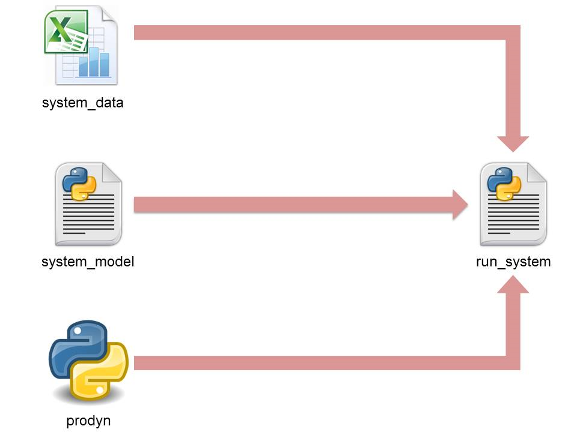

.. currentmodule:: prodyn

.. _overview:

Overview
============
An overview explains the basic procedure of the dynamic programming implementation in the random example. It also introduces files, which are involved in the implementation process, and clarifies main functions inside these files.

Simplified diagram of the process and connection between documents involved in it are shown in the Figure 1.    

   
   Figure 1: Scheme of the dynamic programming implementation
   
According to the diagram any implemetation consists of four files. Three of them (system_data, system_model and run_system) are specified and should be created for each current example. The fourth one (prodyn) is autonomous and can be used with any example without modifications. 

