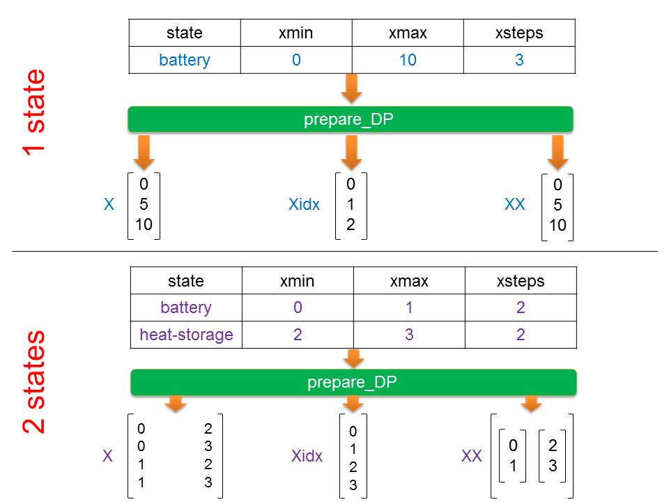
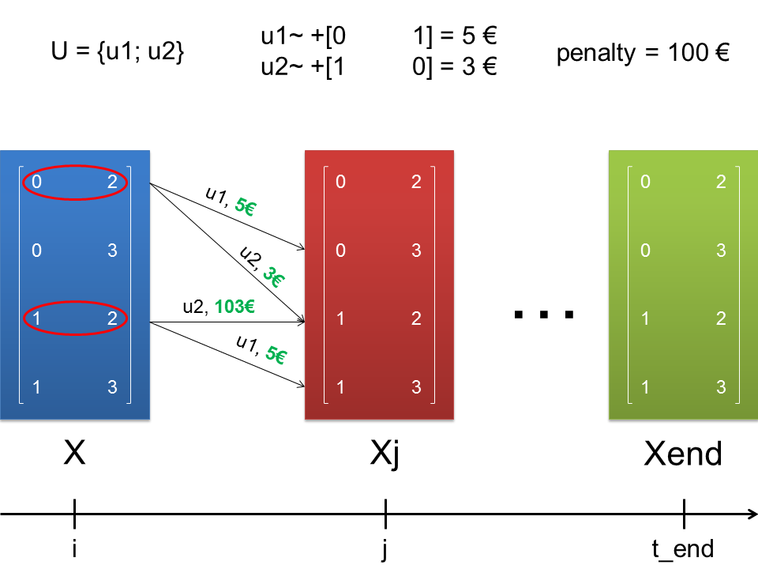
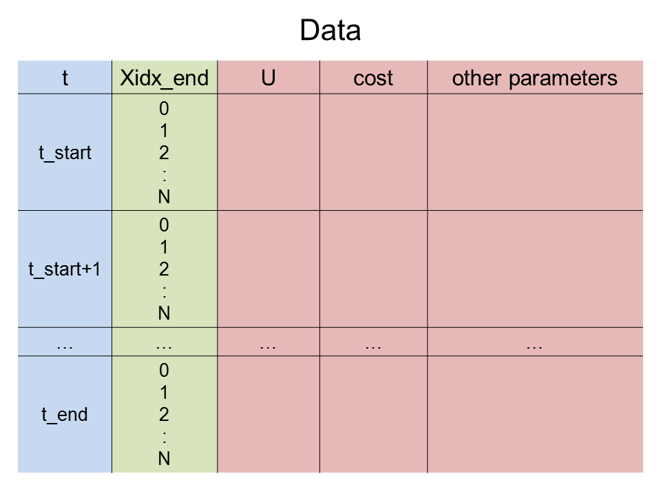

.. currentmodule:: prodyn

.. _prodyn:

Prodyn
============
**Prodyn** is an autonomous file, which is written in python and can be used with any example. This is the core and driving force of every dynamic programming implementation. Three main **prodyn's** functions are described below in details.       

.. _prepareDP-ref:

prepare DP 
^^^^^^^^
The goal of **prepare_DP** is a creation of several arrays, which will be used subsequently. The simplified procedure of the creation for 1 and 2 states random examples is presented in the Figure 6.

   
   Figure 6: Working principle of **prepare_DP** function
   
The table with states of the system, which is stored in **DP-States** sheet of :ref:`system_data <system_data>`, plays a role of input for the **prepare_DP**. Three new arrays are the main returns of the function:
	
	* **X** is an array containing every possible condition of the system. It's size depends on the number of system's states. For example, any  condition of the system with 2 states is always characterized by two variables and **X** is, consequently, 2d. 
	* **Xidx** stores numbers corresponded to every system's condition. This array is always 1-d.
	* **XX** is an array of arrays, from which **X** is built. In other words, **X** is the cartesian product of **XX**.       

DP forward
^^^^^^^^
Current function realizes dynamic programming algorithm in forward direction. Forward means that simulation starts from **t_start** and ends on **t_end**. A diagram, which helps to understand the process inside **DP_forward**, is shown in the Figure 7. 

   
   Figure 7: Processes inside **DP_forward** function

Let's imagine, that we have arbitrary system with 2 states. It has 4 possible conditions, all of them are defined by **X**. **U** contains only two possible decisions **{u1; u2}**, their influence
on the system's condition and their **costs** are described at the top side of Figure 7. **Penalty** is an additional cost for the transition in cases, where system is pushed by **u1** or **u2** to the condition, which system 
can't achieve. 

.. note::

	
	The way **U** influences on the system, value of **costs** and possible **penalties** are always described in :ref:`system_model <system_model>`. Due to this information **prodyn**
	knows how to make the transition from one step to another one for any possible condition of the system. 

In the Figure 7 the transition for **0th** and **2nd** sytem's condition from timestep **i** to timestep **j** is shown. An idea of **penalty** is shown very well, **u2** is applied
on the **2nd** condition. **[1	2]** is forced by **u2** to be **[2	2]**, which is impossible. In such way **prodyn** runs the system through the whole timesteps until **t_end** is reached.
The one and only return of the **prodyn** is called **Data**, which structure is presented in the Figure 8.  

   
   Figure 8: **Data** - return of the **prodyn**        

DP backward
^^^^^^^^
