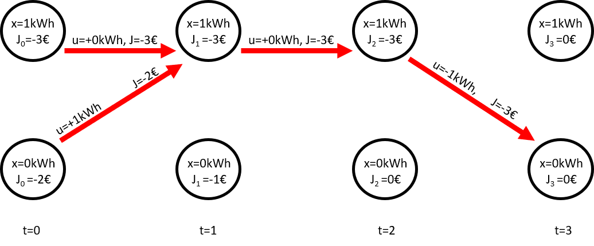
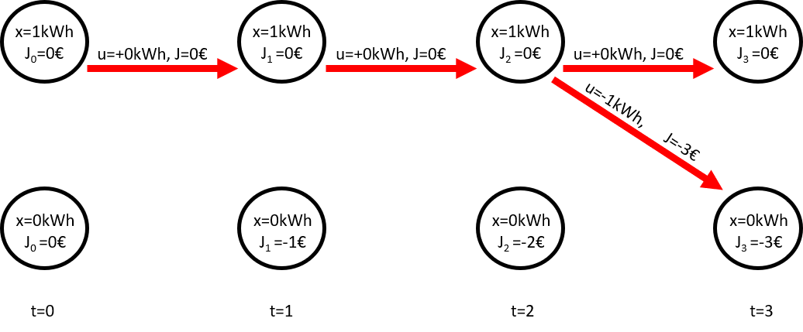

.. currentmodule:: prodyn

.. _prodyn:

Using prodyn
============

Define states and decisions in prodyn
-------------------------------------

.. _states-ref:

States in prodyn
^^^^^^^^^^^^^^^^

In prodyn states are defined using a pandas DataFrame. The index of the 
DataFrame represents the names of the defined state variables. The DateFrame
has three columns:

    * min: The minimum possible value of the state variable 
    * max: The maximum possible value of the state variable
    * xstpeps: The number of discrete states for the state variable

For internal calculations and as an input for the system function, prodyn 
creates an numpy state array X.

When only one state variable is defined, X is a 1-D numpy array of shape 
(xstpeps,)  with xstep values between xmin and xmax. 
For internal calculations, prodyn also calculates an index vector Xidx and an
array that contains all state vectors of each variable XX. For one state 
variable X and XX have the same values. Xidx is the index array of X. 
Every possible state value has a 
coresponding index from zero to the number of discrete states **xsteps** .

 .. csv-table:: Example of states Dataframe for one state variable
   :header-rows: 2
   :stub-columns: 1

      ,xmin,xmax,xsteps
    state, , ,
    battery,0,12,5

 .. math::

	X = \begin{bmatrix}
	0\\ 
	3\\ 
	6\\
        9\\
        12\\
	\end{bmatrix}\:\:\:\:\:\:\:\:
	Xidx = \begin{bmatrix}
	0\\ 
	1\\ 
	2\\
        3\\
        4\\
	\end{bmatrix}\:\:\:\:\:\:\:\:
	XX = \begin{bmatrix}
	0\\ 
	3\\ 
	6\\
        9\\
        12\\
	\end{bmatrix}

For N state variables, X becomes
a 2-D array of shape (N,xstpeps1*xstpeps2*...*xstpepsN).
XX is an array that contains all state vectors of each variable.
X is the cartesian product of XX with all possible state combinations.

Xidx is the index array of X. Every row (possible state combination) gets a 
coresponding index from zero to the number of states 
(xstpeps1*xstpeps2*...*xstpepsN).

 .. csv-table:: Example of states Dataframe for two state variables
   :header-rows: 2
   :stub-columns: 1

      ,xmin,xmax,xsteps
    state, , ,
    battery,0,3,4
    heat-storage,0,5,2

 .. math::

	X = \begin{bmatrix}
	0 & 0\\ 
	0 & 5\\ 
	1 & 0\\ 
	1 & 5\\ 
	2 & 0\\ 
	2 & 5\\ 
    3 & 0\\ 
	3 & 5\\ 
	\end{bmatrix}\:\:\:\:\:\:\:\:
	Xidx = \begin{bmatrix}
	0\\ 
	1\\ 
	2\\
    3\\
    4\\
    5\\
    6\\
    7\\
	\end{bmatrix}\:\:\:\:\:\:\:\:
	XX = \begin{bmatrix}
    \begin{bmatrix}
	0\\ 
	1\\ 
	2\\
    3\\
    \end{bmatrix}
    \begin{bmatrix}
	0\\ 
	5\\ 
    \end{bmatrix}
	\end{bmatrix}

If you want to see how the state vector X, which is an input for the system
funtion, or the index vector Xidx looks like, this is possible by calling 
the function :func:`prepare_DP` .

::

    X, Xidx, XX, xsteps, columns, columns_u = prodyn.prepare_DP(states)

.. function:: prepare_DP(states)
  
  :param states: pandas DataFrame where each index represents a state variable
  :param xmin: minimum value of the state variable
  :param xmax: maximum value of the state variable
  :param xstpes: number of discretization steps for this state variable
 
  :return: the state vector X and other parameters needed for internal
    calculations.
   
        * X: state vector with all possible state combinations
        * Xidx: index vector
        * XX: array that contains all state vectors of each variable
        * xsteps: arry containig the number of steps for each variable
        * columns: column names needed to create the ``Data`` Dataframe
        * columns_u:  columns with dditional element 'U'

.. _decisions-ref:
        
Decisions in prodyn
^^^^^^^^^^^^^^^^^^^^  
  
All possible decisions in prodyn are simply defined within a list (usually
called **U**)
and can
be numbers or string or any single element data type.
The elements of the list are passed one by one to the system function within a
loop. The system funtion must be able to calculate an valid ouputs for every 
decision u within the list of all decisions U.

Here is one example of defining **U** where the possible decisions are 
[-1,0.+1]

::

    U = [-1,0,1]

    
Here is another example of defining **U** where the possible decisions are 
[charge,normal,discharge]

::

    U = ['charge','normal','discharge']

.. _system-function-ref:

The system function in prodyn
-----------------------------

To use prodyn, a system function that calculates the following state vector 
**x_j** and the cost to go vector **cost** for each element of the state vector
**X**. The function has to be defined with 6 inputs and has to return 3 outputs.
How the outputs are calculated inside the function can be chosen freely. It is 
also possible to call external functions or programs. Also the names of the 
funtion itself, and its inputs and outputs can be different than in the 
following description.
But they have to be in the right order and the right data type.

.. function:: sytem_function(u,X,t,cst,srs,Data)
  
  :param u: current decision, one element of the defined decisions U
  :param X: state vector with all possible state combinations
  :param int t: current timestep
  :param cst: any type of variable that is directly passed to the system function 
    and can be used inside the system function
  :param srs: any type of variable that is directly passed to the system function 
    and can be used inside the system function  
  :param Data: pandas DataFrame that contains the results from the previously
    calculated timesteps. It can be accessed in the same way as the result data
    (see :ref:`access-ref`)
  
  
  :return: **cost** for getting to following state **x_j** and additional **data**
   
        * cost: cost to go vector, containg the costs gor every possible state 
          combination when applying decision u at the current timestep t,
          1-D numpy array with the same number of elements as possible state 
          combinations in X
        * x_j: calculated following states of each state in X,
          numpy array with the same shape as X.
        * data: pandas DataFrame allowing to store additional parameters in 
          the result DataFrame **Data**, which will also be an input for the system
          function in the following timestep. 
  
  
The inputs **cst** and **srs** are parameters that are an input to the DP
funtion and directly  passed to the system funtion. They are not neccesary
for DP and can have any data type. They are ment to be used inside the system
funtion representing constant (cst) and time dependent (srs) data. You can 
also just use one of them or none, but they have to be defines as inputs in
your system funtion.

The funtion output **data** allows on to pass other caöcuöated variables than
the state variables to the result DataFrame **Data**, which is also an input
to the system function and can also be accesed at every call.
The index of **data** has to be a range from
zero to M-1, where M is the number of state combinations. **data** has to be 
defined even if no additional parameters should be passed to **Data**. For 
each parameter that  should be passed, simply a new colums with its name 
and a valid value for each index has to be created. Make sure, that the column
names are neither 'U', 'J' nor one of the state variable names.

.. _DP-back-func-ref:

Backward Dynamic Programming :func:`DP_backward`
------------------------------------------------

If you have defined your states, decisions, timesteps and the system function,
you can simply run the funtion :func:`DP_backward` to find the optimal solution
of your system using backward DP. The timesteps are simply a numpy array
containg all timesteps of your optimization horizon. The parameters **cst**
and **srs** are ment to be used in the system function and can be set to None
if not needed.

.. function:: DP_backward(states,U,timesteps,cst,srs,system,[J0=None,verbose=False,t_verbose=1)
  
  :param states: pandas dataframe where each index represents a state variable
    see :ref:`states-ref`
  :param U: List of possible decision, see :ref:`decisions-ref`
  :param timesteps: numpy array containing all timesteps
  :param cst: (Constant) Parameters for system simulation
  :param srs: (Time-series) parameters for system simulation
  :param system: function to simulate the system that is optimized using DP, 
    see :ref:`system-function-ref`
  :param J0: Cost vector for first time-step, allows to define initial start costs 
    and therby select a certain end state for backward DP. JT has to be a 1D numpy
    array with the same nuber of elements as defined state combinations in X. 
    See :ref:`init-costs-ref` .
    Each element defines the initial end cost of the coresponding state.  
  :param verbose: Bool, turn shell output on (True) or off (False)
  :param t_verbose: Show output every t_verbose timesteps
  
  :return: Data: pandas DataFrame with results, see :ref:`access-back-ref`

.. _DP-forw-func-ref:  
  
Forward Dynamic Programming :func:`DP_forward`
-----------------------------------------------

If you have defined your states, decisions, timesteps and the system function,
you can simply run the funtion :func:`DP_forward` to find the optimal solution
of your system using forward DP. The timesteps are simply a numpy array
containg all timesteps of your optimization horizon. The parameters **cst**
and **srs** are ment to be used in the system function and can be set to None
if not needed.

.. function:: DP_forward(states,U,timesteps,cst,srs,system,[JT=None,verbose=False,t_verbose=1)

  :param states: pandas dataframe where each index represents a state variable
    see :ref:`states-ref`
  :param U: List of possible decision, see :ref:`decisions-ref`
  :param timesteps: numpy array containing all timesteps
  :param cst: (Constant) Parameters for system simulation
  :param srs: (Time-series) parameters for system simulation
  :param system: function to simulate the system that is optimized using DP, 
    see :ref:`system-function-ref`
  :param JT: Cost vector for last time-step, allows to define initial end costs 
    and therby select a certain end state for backward DP. JT has to be a 1D numpy
    array with the same nuber of elements as defined state combinations in X. 
    See :ref:`init-costs-ref` .
    Each element defines the initial end cost of the coresponding state.  
  :param verbose: Bool, turn shell output on (True) or off (False)
  :param t_verbose: Show output every t_verbose timesteps
  
  :return: Data: pandas DataFrame with results, see :ref:`access-forw-ref`

.. _access-ref:
  
Accessing the results
---------------------

The funtions :func:`DP_forward` and :func:`DP_backward` return a pandas 
DataFrame with the results. The result DataFrames of the two functions differ
from each other. How to access the results is explained based on the 
:ref:`simple-storage-ref` .

.. _access-back-ref:

Access backward DP results
^^^^^^^^^^^^^^^^^^^^^^^^^^

The result of the function :func:`DP_backward`
is a pandas DataFrame (called **Data** here) with two indices. **t** represents
the timestep and **Xidx_start** represents the index of the system state after 
finishing the optimization, which is the system state at the first timestep for 
backward DP (see :ref:`DP-back-ref`).

The following table and figure shows the result of the 
:ref:`simple-storage-ref` solved with backward DP.

:func:`DP_backward` always calculates a solution for every possible starting 
state.
For this example we have two results. One if we want to start with an empty
storage, and one if we want to start with full storage. 

For each result we
have the optimal decisions **U**, the total costs **J**, and the values of the
state variables, here **battery** for every timestep. 
If we pass additional values using the 
**data** output of the system function (in this example **cost**), 
this is also part of the result DataFrame. 

While **U**, **J**, and the additional values are defined **during** timestep t,
the state variables are defined as **before** timestep t. This is why in this
example, where we have the defined optimizatiom timesteps [1,2,3], we have
a value for the state variable **battery** for t=4, which is the state before
t=4 (or after t=3).

So index t=1 and Xidx_start=0 means results for timestep t=1 (states before 
t=1) and when starting with the state with index 0.

Index t=1 and Xidx_start=1 means results for timestep t=1 (states before 
t=1) and when starting with the state with index 1.

Index t=2 and Xidx_start=0 means results for timestep t=2 (states before 
t=2) and when starting with the state with index 0, and so on.

Note that Xidx_start represents the **index** of state vector X, not the state
value (although in our example there is no difference). So to find the results
for any state combination in X, we have to know the coresponding value in Xidx,
which is the index array (see :ref:`states-ref`). The function 
:func:`find_index` finds the (closest) corresponding index for any given 
state value (combination). See :ref:`find-index-ref` .

.. csv-table:: result for the simple storage example solved with backward DP
   :header-rows: 2
   :stub-columns: 2

     , ,J,U,cost,battery
    t,Xidx_start, , , , 
    1,0,-2,1,1,0
    ,1,-3,0,0,1
    2,0,-3,0,0,1
    ,1,-3,0,0,1
    3,0,-3,-1,-3,1
    ,1,-3,-1,-3,1
    4,0,NaN,NaN,NaN,0
    ,1,NaN,NaN,NaN,0

   
   Result for the simple storage example solved with backward DP
   
   
To acess the results from DataFrame **Data** (which of course can have any
name you choose) 
for any state index **xidx**,
simply use the :func:`pandas.DataFrame.xs` function with level='Xidx_start'

::

    result_xidx = Data.xs(xidx,level='Xidx_start')

The result will be a pandas DataFrame with index t and the same colums as before
    
    
For our example accessing the results for starting with an empty storage
(Xidx_start=0) will give us the following result
    
::

    result_0 = Data.xs(0,level='Xidx_start')    

.. csv-table:: result for the simple storage example solved with backward DP for starting with an empty storage
   :header-rows: 2
   :stub-columns: 1

     ,J,U,cost,battery
    t, , , , 
    1,-2,1,1,0
    2,-3,0,0,1
    3,-3,-1,-3,1
    4,NaN,NaN,NaN,0
    

.. _access-forw-ref:
    
Access forward DP results
^^^^^^^^^^^^^^^^^^^^^^^^^^

The result of the function :func:`DP_forward`
is a pandas DataFrame (called **Data** here) with two indices. **t** represents
the timestep and **Xidx_end** represents the index of the system state after 
finishing the optimization, which is the system state after the last timestep 
for forward DP (see :ref:`DP-back-ref`).

The following table and figure shows the result of the 
:ref:`simple-storage-ref` solved with forward DP.

:func:`DP_forward` always calculates a solution for every possible ending 
state.
For this example we have two results. One if we want to end with an empty
storage, and one if we want to end with a full storage. 

For each result we
have the optimal decisions **U**, the total costs **J**, and the values of the
state variables, here **battery** for every timestep. 
If we pass additional values using the 
**data** output of the system function (in this example **cost**), 
this is also part of the result DataFrame. 

While **U**, **J**, and the additional values are defined **during** timestep t,
the state variables are defined as **before** timestep t. This is why in this
example, where we have the defined optimizatiom timesteps [1,2,3], we have
a value for the state variable **battery** for t=4, which is the state before
t=4 (or after t=3).

So index t=1 and Xidx_end=0 means results for timestep t=1 (states before 
t=1) and when ending with the state with index 0.

Index t=1 and Xidx_end=1 means results for timestep t=1 (states before 
t=1) and when ending with the state with index 1.

Index t=2 and Xidx_end=0 means results for timestep t=2 (states before 
t=2) and when ending with the state with index 0, and so on.

Note that Xidx_end represents the **index** of state vector X, not the state
value (although in our example there is no difference). So to find the results
for any state combination in X, we have to know the coresponding value in Xidx,
which is the index array (see :ref:`states-ref`). The function 
:func:`find_index` finds the (closest) corresponding index for any given 
state value (combination). See :ref:`find-index-ref` .

.. csv-table:: result for the simple storage example solved with forward DP
   :header-rows: 2
   :stub-columns: 2

     , ,J,U,cost,battery
    t,Xidx_end, , , , 
    1,0,0,0,0,1
    ,1,0,0,0,1
    2,0,0,0,0,1
    ,1,0,0,0,1
    3,0,-3,-1,-3,1
    ,1,0,0,0,1
    4,0,NaN,NaN,NaN,0
    ,1,NaN,NaN,NaN,1

   
   Result for the simple storage example solved with forward DP
   
   
To acess the results from DataFrame **Data** (which of course can have any
name you choose) 
for any state index **xidx**,
simply use the :func:`pandas.DataFrame.xs` function with level='Xidx_end'

::

    result_xidx = Data.xs(xidx,level='Xidx_end')

The result will be a pandas DataFrame with index t and the same colums as before
    
    
For our example accessing the results for ending with an empty storage
(Xidx_endt=0) will give us the following result
    
::

    result_0 = Data.xs(0,level='Xidx_end')    

.. csv-table:: result for the simple storage example solved with backward DP for starting with an empty storage
   :header-rows: 2
   :stub-columns: 1

     ,J,U,cost,battery
    t, , , , 
    1,0,0,0,1
    2,0,0,0,1
    3,-3,-1,-3,1
    4,NaN,NaN,NaN,0

.. _find-index-ref:
    
Using :func:`find_index`
-----------------------

For accessing the results or creating initial costs, it is usefull to know
the corresponding index of a state value (combination). The function 
:func:`find_index` returns the index of X (the corresponding entry in Xidx)
for the state which is closest to a given input state value.

.. function:: find_index(xvalues,states)
  
  :param xvalues: array of states, for which the index is needed 
  :param sates: pandas dataframe where each index represents a state variable
		* xmin: minimum value of the state variable
		* xmax: maximum value of the state variable
		* xstpes: number of discretization steps for this state variable
  
  :return: idx: vector that contains the index of X, which value is 
    the nearest to xvalues 

Here is an example of using :func:`find_index` for one state variable

.. csv-table:: Example of states Dataframe for one state variable
   :header-rows: 2
   :stub-columns: 1

      ,xmin,xmax,xsteps
    state, , ,
    battery,0,12,5

.. math::

	X = \begin{bmatrix}
	0\\ 
	3\\ 
	6\\
    9\\
    12\\
	\end{bmatrix}\:\:\:\:\:\:\:\:
	Xidx = \begin{bmatrix}
	0\\ 
	1\\ 
	2\\
    3\\
    4\\
	\end{bmatrix}\:\:\:\:\:\:\:\:
    
::

    find_index([0],states)
    >> 0
    
    find_index([9],states)
    >> 3
    
    find_index([7],states)
    >> 2

And another example of using :func:`find_index` for one two state variables    
    
    
.. csv-table:: Example of states Dataframe for two state variables
   :header-rows: 2
   :stub-columns: 1

      ,xmin,xmax,xsteps
    state, , ,
    battery,0,3,4
    heat-storage,0,5,2

.. math::

	X = \begin{bmatrix}
	0 & 0\\ 
	0 & 5\\ 
	1 & 0\\ 
	1 & 5\\ 
	2 & 0\\ 
	2 & 5\\ 
    3 & 0\\ 
	3 & 5\\ 
	\end{bmatrix}\:\:\:\:\:\:\:\:
	Xidx = \begin{bmatrix}
	0\\ 
	1\\ 
	2\\
    3\\
    4\\
    5\\
    6\\
    7\\
	\end{bmatrix}\:\:\:\:\:\:\:\:

    
::

    find_index([0,5],states)
    >> 1
    
    find_index([3,0],states)
    >> 6
    
    find_index([1.1,2],states)
    >> 2

.. _init-costs-ref: 
    
Define initial costs
--------------------

To define intial start costs J0 for forward DP or intial end costs JT for 
backward DP, create a 1D numpy array with the same size as Xidx (the same
size as X for one state variable or the same number of rows like X for
multiple state variables).

The following example shows how to define initial starting costs J0, where the
initial costs for state x=3 (xidx=1) is set to -9999. (numpy is imported as np)

::

    J0 = np.zeros(5)
    J0[1]=-9999

.. math::

	X = \begin{bmatrix}
	0\\ 
	3\\ 
	6\\
    9\\
    12\\
	\end{bmatrix}\:\:\:\:\:\:\:\:
	Xidx = \begin{bmatrix}
	0\\ 
	1\\ 
	2\\
    3\\
    4\\
	\end{bmatrix}\:\:\:\:\:\:\:\:
    J0 = \begin{bmatrix}
	0\\ 
	-9999\\ 
	0\\
    0\\
    0\\
	\end{bmatrix}\:\:\:\:\:\:\:\:
    

The following example shows how to define initial end costs JT, where the
initial costs for state x=(1,5) (xidx=3) is set to -9999. (numpy is imported
as np)

::

    J0 = np.zeros(5)
    J0[1]=-9999
    
    
.. math::

	X = \begin{bmatrix}
	0 & 0\\ 
	0 & 5\\ 
	1 & 0\\ 
	1 & 5\\ 
	2 & 0\\ 
	2 & 5\\ 
    3 & 0\\ 
	3 & 5\\ 
	\end{bmatrix}\:\:\:\:\:\:\:\:
	Xidx = \begin{bmatrix}
	0\\ 
	1\\ 
	2\\
    3\\
    4\\
    5\\
    6\\
    7\\
	\end{bmatrix}\:\:\:\:\:\:\:\:
    JT = \begin{bmatrix}
	0\\ 
	0\\ 
	0\\
    -9999\\
    0\\
    0\\
    0\\
    0\\
	\end{bmatrix}\:\:\:\:\:\:\:\:
