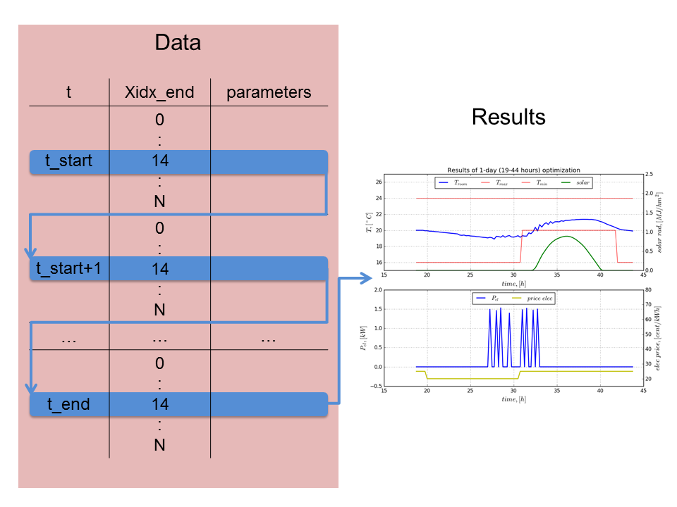

.. currentmodule:: prodyn

.. _run_system:

Run System
============
**Run_system** file is a place, where all other three documents meet and interact between each other. At the end,
when simulation of the system with dynamic programming algorithm is finished, an optimal way of control it is searched.
All parameters, which shows the most optimal path (the cheapest path or the path with empty storage 
at the last timestep), are extracted from the **Data** and plotted for results visualisation. The procedure is 
illustrated in the Figure 9.

   
   Figure 9: The procedure of achieving results   

