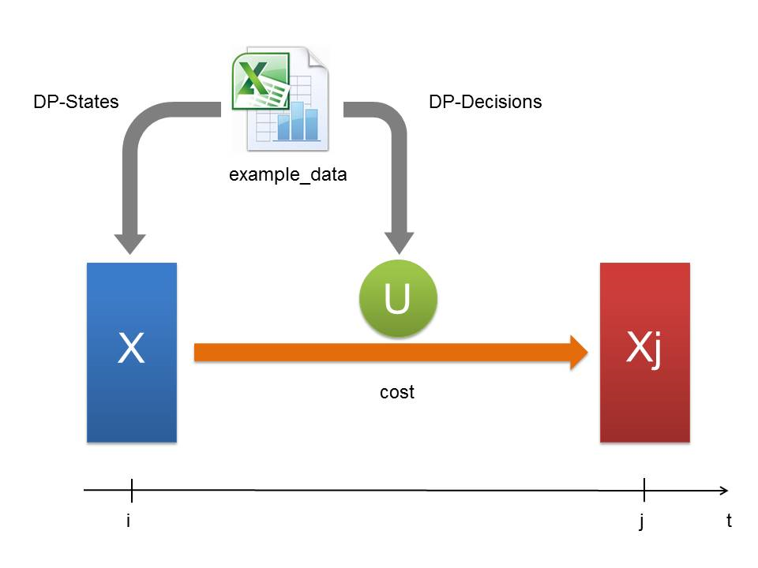
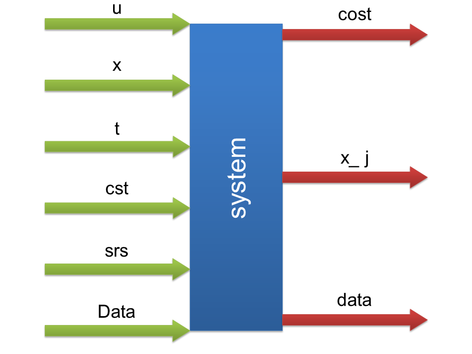

.. currentmodule:: prodyn

.. _system_model:

.. _system_model-ref:

System Model
========================
**System_model** is a file, which is written in python and should be created specifically for the current system. Generally, it contains two functions: **read_data** and **system**. The second one, which describes the transition of the system from one timestep to another one, is the main part of this file. Figure 5 gives simplified illustration of this transition.  

   
   Figure 5: System transition from timestep **i** to **j**
   
System's condition at timestep **i** is defined by an array **X**, which is built from the **DP-States** data. The process of **X** formation is fully described in one of the next subchapters :ref:`prepareDP <prepareDP-ref>`. **System** function calculates the transition from **i** to **j** in dependance of each decision from the list of possible ones **U**. Results of the calculation are an array **Xj**, which describes the condition of the system at timestep **j**, and the **cost** of the transition for each possible decision from **U**.

For your own implementation your own **system** function, which characterizes the transition from **i** to **j**, should be
written. Groups of fixed inputs and outputs of this function are presented in the Figure 6. 

   
   Figure 6: **System's** necessary inputs and outputs for the description of the transition from timestep **i** to **j**
   
**Inputs** of the **system** are: 
  
	* **u** - decision from the possible ones in list **U**.
   	* **x** - array containing any possible condition of the system.
   	* **t** - actual timestep **i**.
   	* **cst** - constants needed for calculation, which are taken from **Constants** in excel file **system_data**.
   	* **srs** - values of needed timeseries taken from **Time-Series**.
   	* **Data** - pandas dataframe, which keeps information about previous transitions. This is main return of the **prodyn** file.
   
**Returns** of the **system** are:
   
      * **cost** - costs of the transition from **i** to **j**.
      * **x_j** - array with condition of the system at timestep **j**, which is formed due to decision **u**.
      * **data** - intermediate pandas dataframe containing additional information about the transition from **i** to **j**. Needed for **Data** formation in **prodyn**.  
      
The remaining function **read_data** is responsible for reading **system_data** and returning the following parameters, which partially form the group of **inputs** of the **system**: **cst**, **srs**, **U** and **states**. **Read_data** for all of the examples presented in the documentation is written for reading **system_data** in excel-from. However, the format or form of **system_data** can be absolutely various. In these cases **read_data** should be rewritten. 

.. note::

	
	Regardless of **system_data** format and it's possible absence **cst**, **srs**, **U** and **states** must always be identified according to the following standarts:
   
      * **cst**, **srs** and **states** - Pandas Data Frames;
      * **U** - 1-d numpy array.

